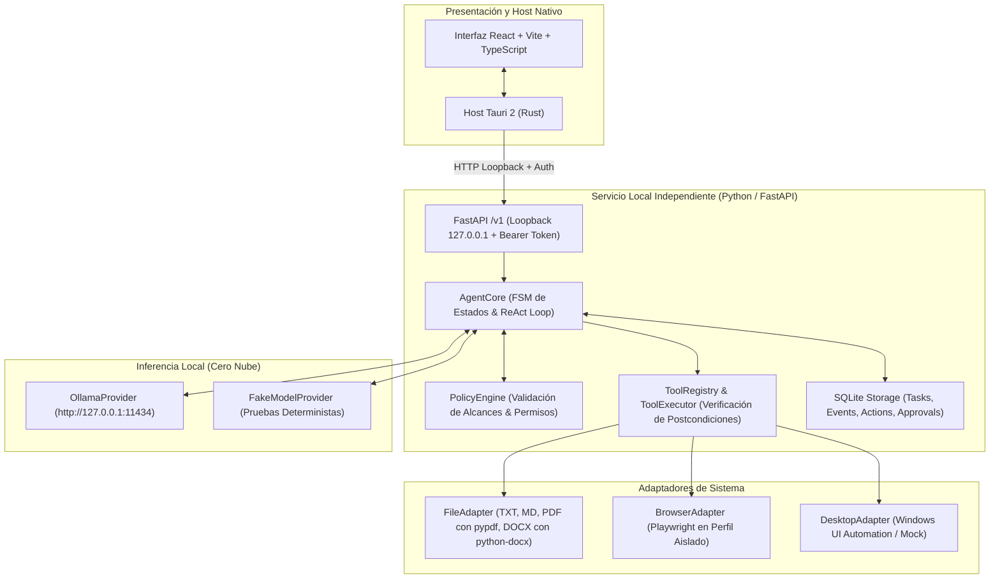
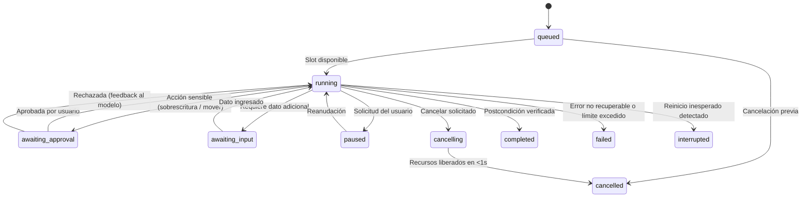

# Arquitectura del Sistema - LocalDesk

**Versión:** 1.0  
**Fecha:** 9 de septiembre de 2026  
**Producto:** LocalDesk - Agente de escritorio con IA local

---

## 1. Visión General

LocalDesk es una aplicación de escritorio y módulo reutilizable que permite a una persona delegar tareas operativas en lenguaje natural (español). El agente razona y ejecuta acciones concretas sobre archivos, aplicaciones de escritorio y navegador, utilizando modelos de lenguaje alojados estrictamente en el equipo mediante Ollama.

El diseño sigue una estricta **Arquitectura Hexagonal (Puertos y Adaptadores)** que separa de forma absoluta:
1. El **Núcleo Lógico** (`AgentCore`, `PolicyEngine`, `StateMachine`).
2. Los **Puertos de Entrada** (FastAPI `/v1`, CLI, host de Tauri).
3. Los **Puertos de Salida** (`ModelProvider`, `DesktopAdapter`, `BrowserAdapter`, `FileAdapter`, `Storage`).

---

## 2. Separación de Responsabilidades

| Componente | Responsabilidad Técnica |
| :--- | :--- |
| **AgentCore** | Orquestación del ciclo ReAct, límites (máx. 40 pasos, 10 min activos), detección de no-progreso y cancelación en < 1 segundo. |
| **PolicyEngine** | Cero confianza en el modelo. Canonicalización estricta de rutas (previene path traversal `../`, symlinks y junctions), clasificación de riesgo y solicitudes de aprobación. |
| **ModelProvider** | Abstracción de inferencia con normalización de llamadas a herramientas (`tool_calls`). Implementa `OllamaProvider` (estricto loopback) y `FakeModelProvider`. |
| **ToolRegistry & Executor** | Esquemas tipados Pydantic, timeouts de 15s por herramienta y verificación independiente de postcondiciones. |
| **DesktopAdapter** | `DesktopAdapterInterface`: `WindowsUIAutomationAdapter` con `pywinauto` para Windows 11 (UC-02) y `SimulatedDesktopAdapter` para tests multiplataforma. |
| **BrowserAdapter** | Automatización web dedicada con Playwright (UC-03) en perfil aislado, sin cookies personales ni extensiones. |
| **FileAdapter** | Lectura estructurada con preservación de secciones/páginas (PDF, DOCX, TXT, MD) y escrituras atómicas verificadas con hash SHA256. |
| **Database & Repositories** | Persistencia serializada en SQLite local (`local_agent.db`) con soporte para WAL, claves foráneas e idempotencia. |
| **API (/v1)** | Contrato OpenAPI REST autenticado con token de sesión en loopback y streaming SSE en `/v1/tasks/{id}/events`. |
| **Desktop UI** | Aplicación React 18 con TypeScript y estilos accesibles, comunicación asíncrona con Tauri y atajo de emergencia global `Ctrl+Alt+Esc`. |

---

## 3. Máquina de Estados Finitos (FSM)

El ciclo de vida de cada tarea se gestiona de forma explícita e inmutable:

### Reglas de Estado:
1. **Concurrencia Unitaria**: Solo una tarea puede estar activa simultáneamente (`running`, `awaiting_approval`, `awaiting_input`, `paused`, `cancelling`). Las demás esperan en `queued`.
2. **Estados Terminales**: `completed`, `failed`, `cancelled`, `interrupted` son terminales. Una repetición con la misma clave de idempotencia retorna el estado existente sin reejecutar efectos.
3. **Recuperación tras caídas**: Al iniciar el servicio, cualquier tarea en `running` o `cancelling` es transicionada automáticamente a `interrupted` para evitar reejecución ciega de efectos sobre el disco.

---

## 4. Política de Seguridad y Permisos (PolicyEngine)

El modelo propone intención y argumentos; el software asigna permisos, identidad y política:

1. **Rutas Canónicas**:
   - Toda ruta pasa por `Path.resolve()`.
   - Se rechazan rutas UNC (`\\servidor\...` o `//servidor/...`).
   - Se verifica que la ruta resultante resida estrictamente dentro de las raíces autorizadas (`read_roots` o `write_roots`).
2. **Clasificación de Riesgos**:
   - **Lectura / Operación Idempotente**: Permitida de forma directa.
   - **Escritura nueva en carpeta autorizada**: Permitida, con escritura atómica en archivo temporal y verificación de hash.
   - **Sobrescritura de archivo existente o movimiento de archivos**: Requiere aprobación de un solo uso (`PENDING_APPROVAL`).
   - **Herramientas de shell libre, eval o borrado permanente**: Terminantemente prohibidas y bloqueadas a nivel de código.
3. **Tratamiento de Contenido**:
   - Todo texto extraído de documentos PDF, DOCX o páginas web es tratado como datos no ejecutables; no puede alterar las instrucciones del sistema ni ampliar permisos.

---

## 5. Garantía de Cancelación en < 1 Segundo

Para asegurar que una tarea pueda detenerse de inmediato sin esperar a que un modelo termine de generar o una herramienta bloquee la UI:
- El gestor de cola mantiene un `asyncio.Event` de cancelación por tarea y la referencia al `asyncio.Task` en ejecución.
- `request_cancel` activa el evento y cancela directamente la tarea asyncio.
- El ciclo de ejecución comprueba el token:
  1. Antes de enviar la solicitud al modelo.
  2. Periódicamente durante la espera del modelo.
  3. Inmediatamente tras recibir la respuesta.
  4. Antes de invocar cualquier herramienta con efectos secundarios.
- Las pruebas automatizadas verifican que el tiempo de respuesta entre el comando de detención y el estado `cancelled` es menor a 1 segundo.
